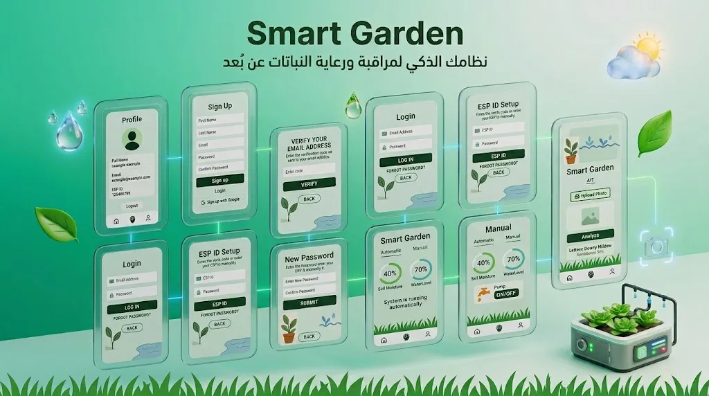

# Smart Garden

Smart Garden is a Flutter-based smart irrigation system that connects an Android application with an ESP32-controlled garden system.

The system combines real-time sensor monitoring, automatic and manual irrigation control, weather-based irrigation decisions, Firebase services, push notifications, and AI-based plant disease analysis.

## App Screenshots

<p align="center">
  
</p>

## Features

### Authentication

* Email/password sign-up with a 5-digit email verification code.
* Email/password login.
* Google Sign-In.
* Password reset using a 5-digit email verification code.
* User profiles stored in Cloud Firestore.

### ESP32 Device Management

* Link a user account to an ESP32 using an ESP ID.
* Validate that the ESP ID exists in Firebase Realtime Database before linking it.
* Store the linked ESP ID in the user's Firestore document.
* Configure the water-tank height from the app.

### Automatic Irrigation

The ESP32 automatically controls the pump using:

* Soil-moisture readings.
* Water-tank level.
* Weather forecast data.
* Rain detection from the weather forecast.

When the soil requires watering and enough water is available, the pump can run automatically. If rain is expected, the irrigation cycle is skipped.

### Manual Irrigation

The app provides a Manual mode that can send a remote pump command through Firebase Realtime Database.

### Real-Time Monitoring

The app displays live data received from the ESP32, including:

* Soil moisture.
* Water-tank level.
* Pump state.
* Forecast temperature and humidity.
* Expected rain.
* Pipe error state.
* Pump error state.

### Pump and Irrigation Monitoring

The ESP32 includes basic checks for:

* Possible pipe leakage or pipe failure.
* Possible pump-stuck/no-flow conditions.
* Low water level.
* Normal irrigation completion.

Detected events are written to Firebase Realtime Database.

### Push Notifications

Firebase Cloud Messaging is used for notifications related to:

* Low water level.
* Expected rain causing irrigation to be skipped.
* Possible pipe problems.
* Possible pump problems.
* Normal irrigation completion.
* Automatic/Manual mode changes.

### AI Plant Disease Analysis

The project includes an AI-based plant disease classification system.

The plant disease model was fine-tuned and trained using plant images, then exported and deployed as an external plant-analysis service.

The diagnosis flow is:

1. The user selects an image from the gallery or captures one using the camera.
2. The Flutter application uploads the image to Firebase Storage.
3. A diagnosis case is created in Cloud Firestore.
4. A Firebase Cloud Function processes the diagnosis request.
5. The image is sent to the deployed plant-analysis service.
6. The trained TensorFlow model analyzes the plant image.
7. The model returns a predicted disease label and confidence score.
8. The diagnosis result is stored in Cloud Firestore.
9. The Flutter application receives the result and displays it to the user.

Firestore is used to manage diagnosis cases and store the AI analysis results. The AI model itself runs in the external plant-analysis service.

## Technology Stack

### Mobile Application

* Flutter
* Dart
* Firebase Authentication
* Cloud Firestore
* Firebase Realtime Database
* Firebase Cloud Messaging
* Firebase Storage
* Google Sign-In
* Image Picker
* HTTP

### Backend

* Firebase Cloud Functions
* Firebase Admin SDK
* Nodemailer
* Axios
* FormData

The Cloud Functions handle:

* Email verification codes.
* Password reset codes.
* Firebase Authentication account creation and password updates.
* Push notifications.
* Realtime Database event triggers.
* Plant-diagnosis processing.

### AI / Plant Disease Analysis

* TensorFlow
* Fine-tuned plant disease classification model
* Plant image classification
* External plant-analysis service

### Hardware / Firmware

* ESP32
* Soil moisture sensor
* Ultrasonic water-level sensor
* Relay-controlled water pump
* 16×2 I2C LCD
* Wi-Fi
* WiFiManager

### External APIs

* OpenWeather forecast API for weather data used by the ESP32.

## System Flow

```text
┌─────────────────────┐
│   Flutter Android   │
│        App          │
└─────────┬───────────┘
          │
          ├──────── Firebase Authentication
          ├──────── Cloud Firestore
          ├──────── Realtime Database
          ├──────── Firebase Storage
          └──────── Firebase Cloud Messaging
                     │
                     ▼
              ┌─────────────┐
              │   Firebase  │
              │    Cloud    │
              │  Functions  │
              └──────┬──────┘
                     │
          ┌──────────┴──────────┐
          │                     │
          ▼                     ▼
 Plant Analysis Service     Push Notifications
          │
          ▼
   TensorFlow Model
          │
          ▼
 Diagnosis + Confidence
          │
          ▼
   Cloud Firestore
          │
          ▼
      Flutter App


┌─────────────────────┐
│        ESP32        │
├─────────────────────┤
│ Soil Sensor         │
│ Ultrasonic Sensor   │
│ Relay + Pump        │
│ I2C LCD             │
└─────────┬───────────┘
          │
          ├──────── Firebase Realtime Database
          │
          └──────── OpenWeather API
```

## Firebase Data Used

The application currently uses these main Firebase structures:

### Cloud Firestore

* `users`
* `pending_signups`
* `password_reset_codes`
* `plantDiagnosis/{userId}/cases`

User documents contain information such as the user's name, email, linked ESP ID, and FCM token.

Plant diagnosis cases store the processing state and analysis result, including information such as:

* Diagnosis status.
* Image path.
* Predicted label.
* Confidence score.
* Error information when applicable.

### Firebase Realtime Database

Device data is stored under:

```text
devices/{espId}
```

The implementation uses values such as:

```text
devices/{espId}/soilRaw
devices/{espId}/waterPercent
devices/{espId}/tankHeight
devices/{espId}/forecastTemp
devices/{espId}/forecastHum
devices/{espId}/isRainExpected
devices/{espId}/pipeError
devices/{espId}/pumpStuckError
devices/{espId}/pumpOn
devices/{espId}/remotePumpOn
devices/{espId}/mode
devices/{espId}/alerts/{alertId}
```

## ESP32 Control Logic

The firmware uses the following main conditions:

* Soil reading of `4095` is treated as the dry-soil condition for automatic irrigation.
* Automatic irrigation requires the water level to be above `20%`.
* Expected rain prevents automatic irrigation.
* The pump is switched through an active-low relay.
* After the pump has been running for approximately 30 seconds, the firmware checks water-level change and soil readings for possible pipe or pump problems.
* A water level at or below `20%` generates a low-water alert.
* The low-water alert can be generated again after the water level rises above `30%`.

These thresholds are implementation values in the current firmware and are not presented as universal sensor calibration values.

## Project Structure

```text
smart_garden_project/
├── android/
├── ios/
├── assets/
├── functions/
│   ├── index.js
│   ├── package.json
│   └── package-lock.json
├── lib/
│   ├── main.dart
│   ├── screens/
│   │   ├── ai_screen.dart
│   │   ├── enter_esp_id.dart
│   │   ├── forgot_password.dart
│   │   ├── home_auto.dart
│   │   ├── home_manual.dart
│   │   ├── login.dart
│   │   ├── new_password.dart
│   │   ├── profile_screen.dart
│   │   ├── sign_up.dart
│   │   ├── verify_email.dart
│   │   └── verify_email_signup.dart
│   └── services/
│       └── push_notifications.dart
├── esp code.txt
├── firebase.json
├── pubspec.yaml
└── README.md
```

## Configuration Required

This repository depends on external Firebase, API, and AI service configuration.

Before running or deploying the complete system:

1. Configure the Firebase Android application for your Firebase project.
2. Configure Firebase Authentication, Cloud Firestore, Realtime Database, Storage, and Cloud Messaging.
3. Configure the Firebase Cloud Functions.
4. Provide the email-service credentials through a secure environment or secret configuration.
5. Provide your OpenWeather API key in the ESP32 firmware configuration.
6. Set your Firebase Realtime Database host in the ESP32 firmware.
7. Configure the external plant-analysis service used by the diagnosis Cloud Function.
8. Configure the deployed TensorFlow plant-disease model used by the plant-analysis service.

Secrets, API keys, passwords, tokens, and private credentials should not be committed to the repository.

## Current Repository Limitations

The following items are present in the source tree but should not be described as completed or self-contained features:

* The ESP32 firmware requires a Firebase Realtime Database host to be configured before it can communicate with Firebase.
* The plant-disease model and its hosting service are external to this repository.
* The Flutter application communicates with the external plant-analysis service through a Firebase Cloud Function.
* `services/push_notifications.dart` exists in the project but is not imported by the current application flow.
* The included default `widget_test.dart` is still the generated Flutter counter-example and does not represent tests for Smart Garden.

## License

No license is currently defined for this project.

